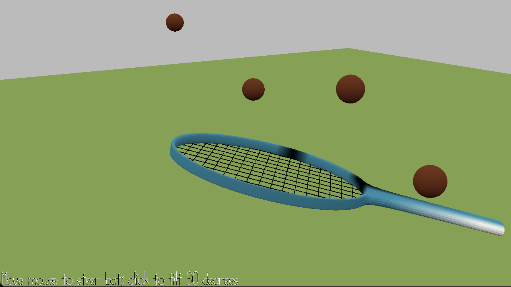

Bat bat

Author: Shangyi Zhu

Design: This game has a fixed overhead camera and an electric racket used to swat bugs.
The racket’s position is controlled by mapping mouse coordinates into normalized device coordinates (NDC) and projecting them into world space, allowing the bat to follow the cursor. 
On mouse clicks, the racket briefly tilts around its handle pivot to simulate a swing. Bugs are spawned as clones of a prototype object at random positions, each with its own velocity and direction. 
They move with slight random jitter, periodically change direction, and automatically rotate to face their movement.

Screen Shot:

How To Play:

Mouse drag to move the racket and mouse click to bat the bugs

This game was built with [NEST](NEST.md).
